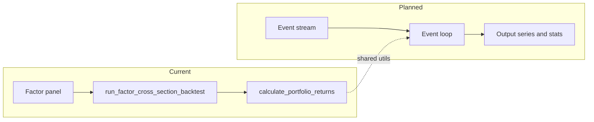

# Event-driven backtesting (design)

This document scopes a **future** engine that complements the existing **cross-sectional factor** pipeline (`core/strategies/factor_runner.py`, `core/backtest/portfolio.py`). Use it for phased delivery decisions.

## Implementation status

**v0 (landed):** [`core/backtest/events/`](../core/backtest/events/) provides:

- `Event` / `EventType` and `EventLog` with **strictly increasing, tz-aware** timestamps (`DataSchemaError` on violation).
- `simulate_equal_weight_rebalances`: minimal path that applies `REBALANCE` events with payload `{"symbols": [...]}` and equal weights; returns a daily return series aligned to the price panel.

**HTTP (landed):** `POST /backtest/events/simulate` in [`api/routes/events_backtest.py`](../api/routes/events_backtest.py) accepts JSON events plus row-oriented `price_rows` (wide daily panel: each row has `date` and one column per symbol). Maps `DataSchemaError` to HTTP 422. See [`api/schemas/events_backtest.py`](../api/schemas/events_backtest.py).

**Next:** intraday bars, richer payloads, optional UI visualization.

## Scope

**In scope for “event-driven” in this repo:**

- A **discrete event log** driving simulation: events have monotonic timestamps and typed payloads (see below).
- **Deterministic** replay: same inputs and config yield the same outputs (reproducibility; seed where randomness exists).
- **Calendar-aware** processing: trading sessions and optional holidays; indexes remain timezone-aware where the rest of the platform uses tz-aware data.

**Out of scope for an initial version (v0):**

- Full **tick-by-tick** matching engine or order book (unless explicitly added later).
- **Live** execution or broker connectivity (paper/live trading remains a separate product gap; see [PLATFORM_STATUS.md](PLATFORM_STATUS.md)).

**Terminology:**

- **Bar event**: OHLCV (or similar) for a symbol at bar close (daily or intraday).
- **Signal event**: strategy output (e.g. target weights, orders) produced from available state up to that time (no look-ahead).
- **Rebalance / order events**: intended portfolio changes; may map to the same portfolio math as today with explicit transaction cost rules.

## Data model (sketch)

Events are append-only records. Example fields (to be refined in implementation):

| Field | Description |
|-------|-------------|
| `ts` | Event time (tz-aware, monotonic within a run) |
| `event_type` | Enum: `bar`, `signal`, `rebalance`, `fill` (optional), `custom` |
| `symbol` | Optional; required for instrument-specific events |
| `payload` | Typed dict or small dataclass (e.g. OHLCV for `bar`, weights for `rebalance`) |

**Rules:**

- No duplicate `(ts, event_type, symbol)` if that would double-apply state; define idempotency per event type.
- Splits and corporate actions: either pre-adjust prices in the data layer or emit `adjustment` events (decision deferred to implementation phase).

## Integration with existing stack

- **Does not replace** cross-sectional factor backtests. Those remain the default for equity factor research and replay frames.
- **Shared components**: reuse `core/metrics/`, transaction cost conventions, and Pydantic schemas for any new HTTP surface.
- **New code location (proposal)**: `core/backtest/events/` or `core/simulation/` for the event loop and state machine; keep `core/backtest/portfolio.py` focused on the current return path unless we extract shared weight/PnL helpers.

## Phased delivery (proposal)

| Phase | Goal |
|-------|------|
| **Design + ADR** | Lock event schema, clock rules, and test fixtures (this doc + follow-up ADR). |
| **v0** | Daily **bar** events only; rebalance on same calendar rules as today; output comparable to factor pipeline for sanity checks. |
| **v1** | Intraday bars (e.g. 1h); optional multiple fills per day. |
| **v2+** | Higher frequency or `fill` events; only if product need is clear. |

## API / UI (future)

- REST: new routes under a dedicated prefix (e.g. `/backtest/events/run`) with Pydantic request bodies; no user-supplied code execution (see `.cursor/rules/quant-strategies.mdc`).
- Frontend: optional visualization of event timeline; not required for v0.

## References

- Platform gaps: [PLATFORM_STATUS.md](PLATFORM_STATUS.md)
- Roadmap ordering: [roadmap.txt](../roadmap.txt)
- Strategy boundaries: [.cursor/rules/quant-strategies.mdc](../.cursor/rules/quant-strategies.mdc)
